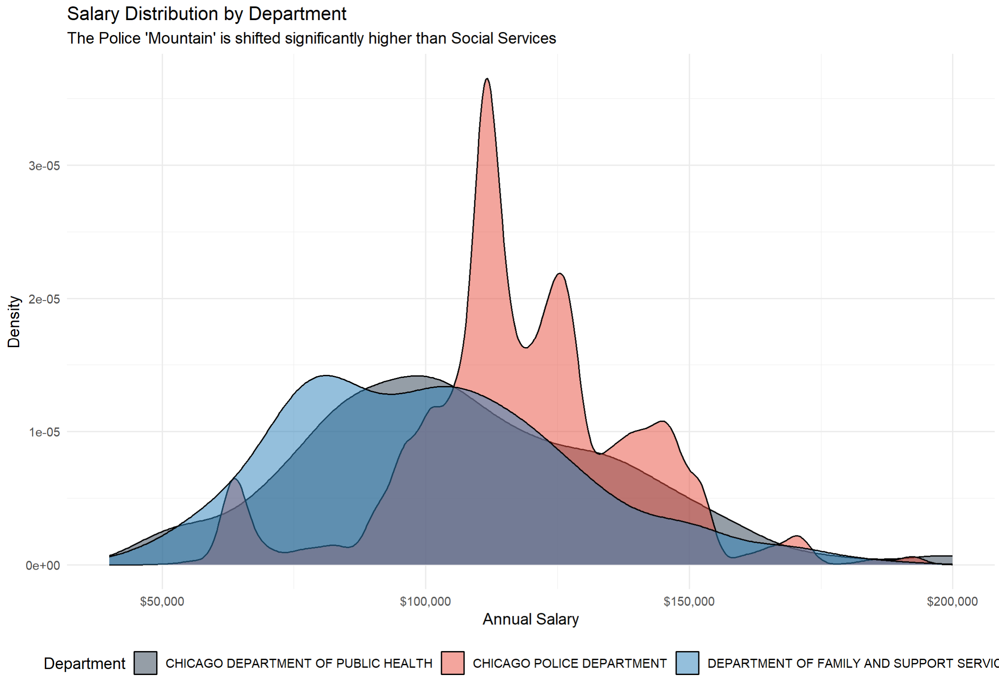
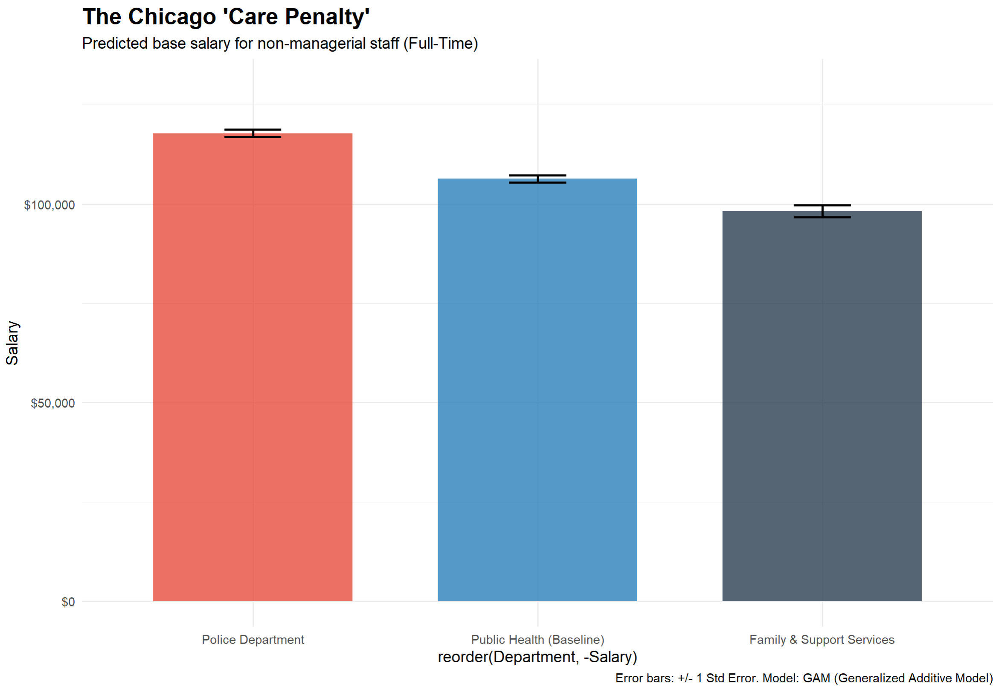

# Chicago-Salary-Analysis-2026
The Chicago "Care Penalty": A Multi-Model Wage Analysis (2026)
📌 Project Overview

This project investigates structural wage disparities across City of Chicago departments using the 2026 municipal payroll dataset. Specifically, it explores the "Care Penalty," the significant pay gap between protective services (Police) and social/health services (Family & Support Services and Public Health).

The Core Finding: Even when controlling for managerial seniority, a $19,654 structural gap exists between the Chicago Police Department and the Department of Family and Support Services.
🛠 The "Data Detective" Methodology

To ensure these findings were not simply a result of statistical noise, I conducted a three-stage methodological investigation:
1. Raw Discovery (ANOVA)

    Goal: Determine if department-level salary differences are statistically significant.

    Results: Confirmed significant variance (p<0.001) with an Eta-Squared calculation proving that department choice is a primary predictor of salary.

    Assumptions: Validated the "Health" of the data through Normality (Bell Curve) and Q-Q plots of the residuals.

2. The Controlled Investigation (Multiple Regression)

    Goal: Test if the gap remains after controlling for seniority (identifying Managers/Directors vs. Staff).

    Diagnostic Challenge: The linear model revealed two critical violations:

        The "Zipzac" (Striping): Vertical clusters in the residuals representing the rigid Union Pay Steps of the city.

        Non-Linearity: A "smile" curve in the residuals, indicating that the pay jump for managers is more complex than a standard straight line can capture.

3. Advanced Validation (Generalized Additive Model - GAM)

    Goal: Deploy a GAM to "bend" to the non-linear jumps in the city's pay structure.

    Victory: The GAM successfully flattened the residual line while confirming the $19k gap remains robust and statistically undeniable (p<0.00000008).

📊 Key Results (Adjusted Estimates)

Based on the final GAM-validated model, the predicted base salaries for non-managerial staff are:

    Chicago Police Department: $117,861

    Department of Public Health: $106,404 (Baseline)

    Family & Support Services: $98,205

🚀 Technical Skills Demonstrated

    R Programming: Advanced use of tidyverse, mgcv (GAM), ggplot2, and scales.

    Statistical Rigor: Mastery of ANOVA, Multiple Linear Regression, and diagnostic interpretation.

    Policy Analysis: Identifying "Care Penalties" and translating complex data into actionable social policy insights.

    Data Visualization: Creating "Signature Visuals" that include Standard Error bars and distribution densities.
